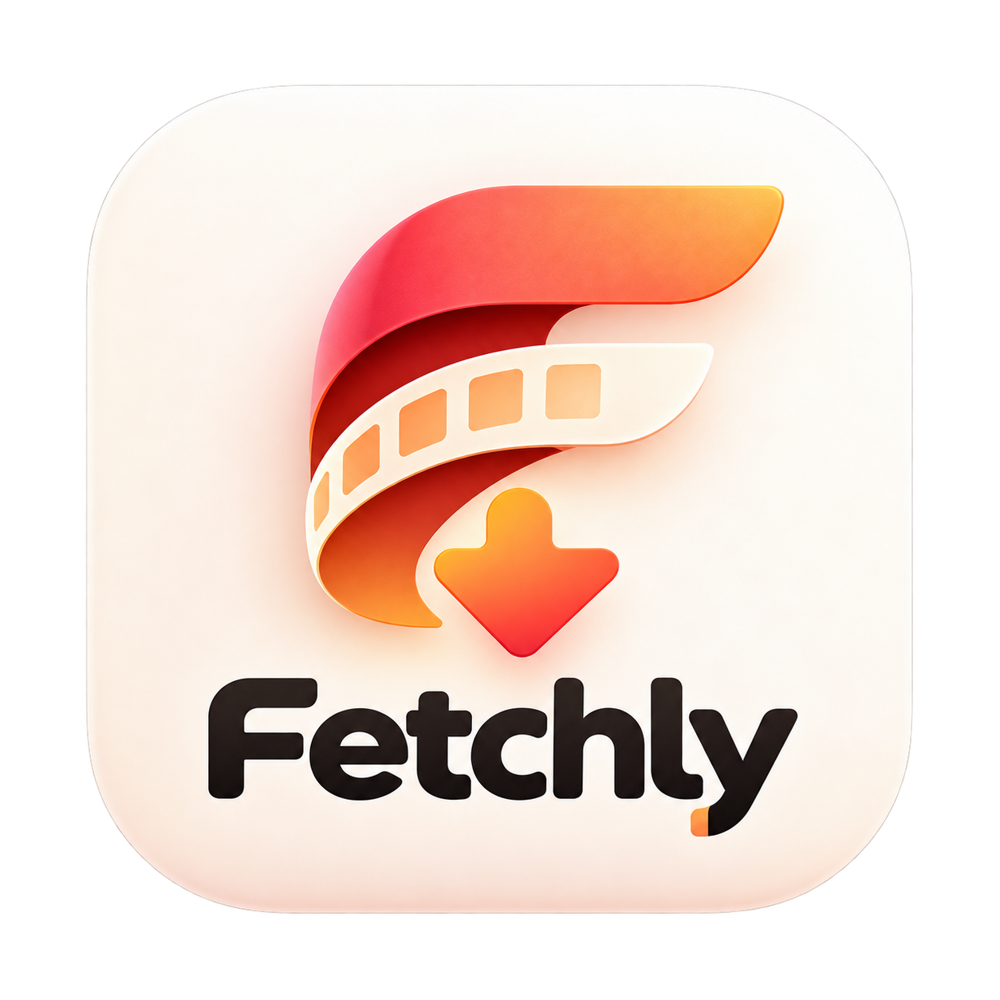

<div align="center">



# Fetchly

**Paste. Choose. Fetch.**

 — Latest: **v1.3**

Paste a public media link, pick a quality, save it to your device.

[](https://github.com/mrduhlol/Fetchly/releases/latest/download/fetchly_v1.3.apk)

</div>

## What it does

1. Paste a media URL
2. Fetchly detects the platform and shows available qualities
3. Download straight to `Movies/Fetchly/`, `Music/Fetchly/` or `Pictures/Fetchly/`

Only publicly accessible media where downloading is permitted. Anything else gets: *"This source isn't currently supported."*

## Build it yourself

Needs JDK 17 + Android SDK (compileSdk 34).

```bash
./gradlew assembleDebug      # APK
./gradlew bundleRelease      # Play Store AAB
./gradlew testDebugUnitTest  # tests
```

Set the API URL via `FETCHLY_API_BASE_URL` env var, `local.defaults.properties` (see `.example` file), or in-app Settings.

## Docs

- [`docs/API.md`](docs/API.md) — backend contract + reference server
- [`docs/PERMISSIONS.md`](docs/PERMISSIONS.md) — permissions used and why
- [`docs/STORAGE.md`](docs/STORAGE.md) — where downloads are saved
- [`docs/SECURITY.md`](docs/SECURITY.md) — security model
- [`docs/RELEASE.md`](docs/RELEASE.md) — releases, env vars, limitations
